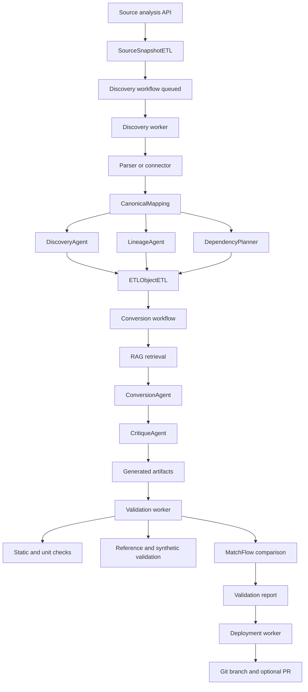
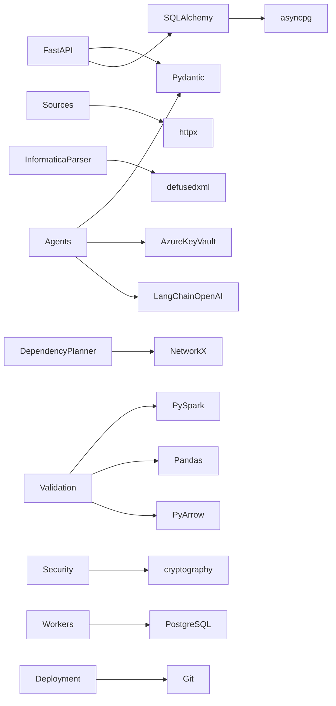

# ETL Migration Command Center
## Engineering Knowledge-Transfer and Architecture Document

**Audience:** Engineering Manager, Skip Manager, Solution Architects, Technical Leads, and project stakeholders  
**Repository:** `ETL-CC`  
**Document scope:** Current repository state as audited on 2026-09-17  
**Primary API prefix:** `/api/v1`

---

## 1. Executive Summary

ETL Migration Command Center (ETL-CC) is a backend platform for migrating legacy ETL workloads into Databricks PySpark. It accepts metadata from Informatica PowerCenter and a feature-flagged synthetic/portable Ab Initio graph format, normalizes each source into a vendor-neutral `CanonicalMapping`, enriches the mapping with discovery and lineage analysis, computes repository dependencies and migration waves, generates target artifacts with GPT-4o, critiques those artifacts, validates them with static checks, generated unit tests, synthetic data, a deterministic reference plan, and output comparison, and can deploy approved artifacts to GitHub.

The platform is implemented as an asynchronous FastAPI plus PostgreSQL plus worker architecture. HTTP endpoints create records and queue work. Dedicated long-running workers claim database-backed jobs using PostgreSQL row locking and persist progress, agent audits, artifacts, test cases, and failures. The active orchestration mechanism is database polling; the LangGraph module is currently scaffolding and is not the runtime orchestrator.

### Current implementation status

| Area | Current state |
|---|---|
| FastAPI application | Implemented |
| PostgreSQL async persistence | Implemented through SQLAlchemy ORM |
| Informatica PowerCenter connector | Implemented, requires `pmrep` |
| Informatica XML upload | Implemented |
| Informatica GitHub XML ingestion | Implemented, non-recursive directory listing |
| Ab Initio ingestion | Implemented for normalized `AB_INITIO_GRAPH_JSON`, feature-flagged off by default |
| Discovery | Implemented in `worker.py` |
| Lineage | Implemented with NetworkX |
| Dependency planning | Implemented with NetworkX |
| RAG retrieval | Implemented as deterministic approved-knowledge retrieval |
| GPT-4o conversion | Implemented |
| GPT-4o critique plus deterministic checks | Implemented |
| Validation | Substantial implementation, strict reference-plan gate |
| Git deployment | Partially implemented; manual/target configuration paths have known issues |
| LangGraph orchestration | Stub: `build_migration_graph()` returns `None` |
| DataStage | Advertised/scaffolded but not implemented |
| Authentication and authorization | Not implemented |
| Fresh database migrations | Incomplete; table creation currently relies on `scripts/create_tables.py` |
| Automated tests | Minimal: parser, dependency helper, and Fernet-format tests |

---

## 2. Business Purpose

### Business problem

Legacy ETL platforms encode business rules in proprietary mappings, transformations, connections, parameters, sessions, and workflows. A manual migration requires engineers and analysts to rediscover the source behavior, determine dependency order, rewrite logic, create tests, compare outputs, and prepare deployable files. This is slow, difficult to audit, and vulnerable to semantic drift.

ETL-CC addresses this by creating a controlled migration pipeline with:

- source connectivity and upload validation;
- canonical vendor-neutral metadata;
- business-purpose, risk, complexity, and prerequisite discovery;
- mapping- and repository-level lineage;
- dependency cycles and migration-wave planning;
- retrieval of approved migration knowledge;
- constrained PySpark generation;
- generated-code critique and revision;
- static, unit, synthetic, reference, and parity validation;
- durable workflow and agent audit records; and
- optional Git-based deployment.

### Expected inputs

1. **Source connection metadata**
   - PowerCenter host, port, repository, domain, username, and password.
   - GitHub URL, branch, folder, and optional token.
2. **Source files**
   - Informatica PowerCenter XML export.
   - Portable Ab Initio graph JSON with `format == "AB_INITIO_GRAPH_JSON"`.
3. **Scope**
   - Entire source repository or selected mapping/graph keys.
4. **Migration options**
   - Target platform `DATABRICKS`.
   - Target framework `PYSPARK`.
   - Whether to follow migration waves.
5. **Validation inputs**
   - Simulated data, uploaded dataset files, or PostgreSQL table selections.
6. **Deployment inputs**
   - GitHub target repository, branch, path, commit, and pull-request options.

### Expected outputs

- Source-analysis response with source ID, signed test token, and mapping inventory.
- Repository and workflow records.
- Canonical mapping records.
- Discovery business analysis, risks, assumptions, complexity, and recommendations.
- Component and field lineage.
- Dependency graph and migration waves.
- Agent audit records and workflow events.
- PySpark transformation, pytest unit test, and JSON configuration artifacts.
- Static/unit/reference/parity validation reports.
- Optional Git branch, commit, and pull request.

---

## 3. Architectural Overview

### Architecture style

The implementation is a modular asynchronous backend with these layers:

```text
HTTP API
  -> request models and route validation
  -> service layer
  -> PostgreSQL state and queue records
  -> polling workers
  -> source adapters and parsers
  -> canonical mapping
  -> discovery/lineage/dependency agents
  -> RAG/conversion/critique agents
  -> validation agents and subprocesses
  -> artifacts, reports, events, and optional deployment
```

### Major architectural decisions

- **FastAPI:** HTTP API, OpenAPI/Swagger, dependency injection for database sessions.
- **Pydantic:** request, response, and structured agent contracts.
- **SQLAlchemy async:** ORM and PostgreSQL persistence.
- **PostgreSQL JSONB:** canonical mapping and agent evidence are flexible nested structures.
- **Database queue:** workflow rows act as durable jobs.
- **`FOR UPDATE SKIP LOCKED`:** multiple worker instances can compete safely for queued jobs.
- **Canonical mapping boundary:** source-specific parsing ends at `CanonicalMapping` wherever possible.
- **LLM plus deterministic controls:** GPT-4o handles semantic interpretation and code generation; deterministic validators enforce structural safety.
- **PostgreSQL artifact content:** generated content is stored in `artifact_content_etl`; artifact metadata is stored separately.
- **Temporary source retention:** uploaded source bytes remain in PostgreSQL between source analysis and discovery, then are cleared after successful canonicalization.

### High-level workflow



---

## 4. Repository Structure

### Root-level files and directories

| Folder/file | Purpose | Used by | Depends on | Importance |
|---|---|---|---|---|
| `README.md` | Basic setup and current feature notes | Developers | Uvicorn, `src` package | High but incomplete |
| `requirements.txt` | Python dependency declarations | Installation, Docker | PyPI packages | Critical |
| `Dockerfile` | API container image | Container deployment | `requirements.txt` | High |
| `deploy_dev.sh` | systemd start/stop/restart/status/log helper | Linux development deployment | systemd, curl, journalctl | Medium; environment-specific |
| `.gitignore` | Excludes `.env`, virtualenv, bytecode, pytest cache | Git | Git | Medium |
| `migrations/` | SQL changes and validation table scripts | Database operations | PostgreSQL | Critical but incomplete |
| `prompts/` | Intended prompt repository | Documentation/future prompt loading | None at runtime currently | Low currently |
| `scripts/` | Database and key utilities | Operators/developers | App settings and database | High |
| `runtime_sources/` | Checked-in source fixtures and legacy manifests | Tests/manual demos | Parser contracts | Medium; active source storage no longer uses it |
| `runtime_validation_data/` | Generated/check-in validation data | Validation inspection and fixtures | Validation agent | Medium |
| `src/etl_cc/` | Application package | API and all workers | All internal modules | Critical |
| `tests/` | Automated test cases | CI/developers | pytest | High but sparse |
| `docs/` | This KT document | Engineering and stakeholders | Repository code | High for transfer |

### `src/etl_cc` package map

| File | Responsibility | Main symbols |
|---|---|---|
| `__init__.py` | Package marker | None |
| `main.py` | FastAPI application entry point, CORS, logging, router registration | `app`, `root` |
| `api.py` | REST/SSE route definitions and HTTP error translation | `router`, route handlers |
| `config.py` | Environment-backed settings and path/database properties | `Settings`, `settings`, `get_settings` |
| `database.py` | Async PostgreSQL engine, ORM base, session dependency | `Base`, `engine`, `SessionFactory`, `get_session` |
| `models.py` | ORM tables and Pydantic API/agent contracts | `RepositoryETL`, `ETLObjectETL`, `WorkflowRunETL`, request/response models |
| `services.py` | Source analysis, workflow creation, reporting, migration, deployment services | `analyze_*`, `start_*`, `get_*`, `list_*` |
| `connectors.py` | External source and GitHub target adapters | `PowerCenterSource`, `GitHubSource`, `GitHubDeploymentTargetConnector` |
| `informatica_parser.py` | Secure PowerCenter XML parser and canonicalizer | `InformaticaXMLParser` |
| `ab_initio_parser.py` | Portable Ab Initio graph JSON parser and canonicalizer | `AbInitioGraphParser` |
| `source_store.py` | Temporary PostgreSQL source snapshot storage | `create_source`, `load_manifest`, `load_content`, `consume_source_content` |
| `artifact_store.py` | Safe local text artifact storage utility | `ArtifactStore`, `artifact_store` |
| `validation_store.py` | Local staged validation dataset storage | `ValidationStore`, `validation_store` |
| `security.py` | Fernet credentials and signed connection-test tokens | `CredentialCipher`, token helpers |
| `key_vault_service.py` | Azure Key Vault secret lookup and OpenAI wrapper | `KeyVaultService`, `DynamicChatOpenAI` |
| `worker.py` | Discovery queue consumer | `run_worker`, `_claim`, `_process` |
| `conversion_worker.py` | Conversion/critique queue consumer and artifact persistence | `run_conversion_worker`, mapping processing functions |
| `validation_worker.py` | Validation queue consumer and result persistence | `run_validation_worker`, `_process` |
| `deployment_worker.py` | Git deployment queue consumer | `main`, `_claim`, deployment processing |
| `dependency_planner.py` | Repository dependency graph and waves | `DependencyPlanner` |
| `engines.py` | Standalone migration-wave helper | `calculate_migration_waves` |
| `economics.py` | Discovery effort/cost estimates | `DiscoveryEconomicsPolicy`, calculation functions |
| `logging_config.py` | JSON logging, sanitization, event helpers | `configure_logging`, `log_event`, `log_exception` |
| `orchestrator.py` | Intended LangGraph entry point | `build_migration_graph` (stub) |
| `validation_test_case_service.py` | Validation test-case upsert/replace helpers | `upsert_test_case`, `replace_planned_test_cases` |

### `agents/` directory

| File | Agent/component | Role |
|---|---|---|
| `discovery_agent.py` | `DiscoveryAgent` | Complexity, prerequisites, business rules, risks, GPT semantic analysis |
| `lineage_agent.py` | `LineageAgent` | NetworkX component and field lineage |
| `rag_retrieval_agent.py` | `RAGRetrievalAgent` | Approved knowledge retrieval |
| `conversion_agent.py` | `ConversionAgent` | GPT-4o PySpark, pytest, configuration generation |
| `critique_agent.py` | `CritiqueAgent` | Deterministic and GPT critique |
| `validation_agent.py` | `ValidationAgent` plus supporting contracts/executors | Full validation pipeline |
| `test_plan_agent.py` | `TestPlanAgent` | Deterministic validation planning |
| `unit_test_execution_agent.py` | `UnitTestExecutionAgent` | Restricted generated pytest execution |
| `functional_parity_agent.py` | `FunctionalParityAgent` | Functional coverage/parity support |
| `static_validation_agent.py` | `StaticValidationAgent` | Static artifact checks |
| `matchflow_comparator.py` | `MatchFlowComparator` | Keyed output comparison with tolerance |
| `deployment_agent.py` | `GitDeploymentAgent` | Git deployment eligibility and execution contracts |
| `__init__.py` | Package marker | None |

---

## 5. Application Flow

### 5.1 Source analysis flow

1. Client calls a source-analysis route in `api.py`.
2. FastAPI validates the request using Pydantic models from `models.py`.
3. The API delegates to `services.py`.
4. The service invokes a connector/parser:
   - `PowerCenterSource.list_mappings()`;
   - `GitHubSource.list_mappings()`;
   - `InformaticaXMLParser.list_mappings_bytes()`; or
   - `AbInitioGraphParser.list_mappings_bytes()`.
5. The service creates a `SourceSnapshotETL` row using `source_store.create_source()`.
6. The service stores a manifest containing product, method, source ID, configuration, hash, and source metadata.
7. `_response()` creates a signed short-lived test token.
8. The API returns mapping inventory, `source_id`, and `test_token`.

### 5.2 Discovery flow

1. Client calls `POST /discoveries` with `source_id`, `test_token`, and scope.
2. `services.start_discovery()` loads the source manifest and verifies the token signature and configuration hash.
3. It creates `RepositoryETL`, `WorkflowRunETL`, and an initial `WorkflowEventETL`.
4. The discovery worker polls for `job_type == DISCOVERY` and `job_status == QUEUED`.
5. `_claim()` locks one row with `FOR UPDATE SKIP LOCKED`, marks it `RUNNING`, and increments the attempt count.
6. `_load_mappings()` selects the source path:
   - Ab Initio parser for `product_code == AB_INITIO`;
   - Informatica XML parser for `XML_UPLOAD`;
   - PowerCenter or GitHub connector for live/exported Informatica sources.
7. `_upsert()` serializes each `CanonicalMapping` into `ETLObjectETL.source_definition`.
8. `DiscoveryAgent.run(mapping)` returns structured discovery analysis.
9. `LineageAgent.run(mapping)` computes field/component lineage.
10. `DependencyPlanner.run(mappings)` builds repository dependencies and migration waves.
11. Agent outputs are audited in `AgentResponseETL` and progress is written to `WorkflowEventETL`.
12. The workflow is marked completed and temporary source bytes are consumed.

### 5.3 Conversion flow

1. Client calls `POST /conversions` or `POST /migrations`.
2. `services.start_conversion()` verifies mapping ownership and readiness:
   - `discovery_status == ANALYZED`;
   - no dependency cycle;
   - `migration_wave` exists.
3. A `CONVERSION` workflow is queued.
4. `conversion_worker.py` claims it.
5. It loads canonical mapping, latest discovery, lineage, dependencies, and RAG context.
6. `RAGRetrievalAgent` retrieves approved knowledge.
7. `ConversionAgent` generates exactly three artifact types:
   - `PYSPARK_CODE`;
   - `UNIT_TEST`;
   - `CONFIGURATION`.
8. `CritiqueAgent` runs deterministic checks and GPT-4o critique.
9. Failed critique results are fed back for up to `conversion_max_attempts` attempts.
10. Approved artifacts are saved to `GeneratedArtifactETL` and `ArtifactContentETL`.
11. For parent migrations, conversion automatically queues validation.

### 5.4 Validation flow

1. The conversion worker creates a validation workflow for a parent migration, or the client calls `POST /validations` directly.
2. `validation_worker.py` claims the queued validation row.
3. It materializes PostgreSQL artifact content into a temporary directory.
4. `ValidationAgent` performs:
   - artifact/static checks;
   - generated unit-test execution;
   - synthetic test generation and schema validation;
   - deterministic reference-plan generation and validation;
   - relational reference execution;
   - generated PySpark target execution;
   - MatchFlow output comparison;
   - confidence and deployability gating.
5. Validation test cases are persisted in `ValidationTestCaseETL`.
6. Mapping and artifact statuses are updated.
7. A parent migration is marked `VALIDATED` or `VALIDATION_FAILED`.
8. Optional automatic deployment is queued only if all mappings pass and global deployment configuration exists.

### 5.5 Deployment flow

1. A deployment target is tested and saved through GitHub target APIs, or automatic deployment settings are used.
2. `start_deployment()` creates deployment-related workflow records.
3. `deployment_worker.py` materializes validated artifact content, verifies hashes, clones Git, creates a branch, writes files and a manifest, commits, pushes, and optionally creates a pull request.
4. Deployment events and mapping statuses are persisted.

### Text data-flow diagram

```text
Client request
  -> FastAPI route
  -> Pydantic validation
  -> service function
  -> SourceSnapshotETL / WorkflowRunETL
  -> PostgreSQL queue
  -> worker claim
  -> connector/parser
  -> CanonicalMapping
  -> ETLObjectETL.source_definition
  -> agent execution and AgentResponseETL
  -> WorkflowEventETL
  -> generated artifacts / validation cases
  -> API query response
```

---

## 6. Database Analysis

### Database and connection

- Database: PostgreSQL.
- Driver: `asyncpg`.
- ORM: SQLAlchemy 2 async.
- URL assembled in `Settings.database_url` using `pg_host`, `pg_port`, `pg_db`, `pg_user`, and `pg_password`.
- Schema defaults to `demooc28` but is configurable through `pg_schema`.
- `database.py` exposes `SessionFactory` and FastAPI's `get_session()` dependency.

### Table inventory

#### `validation_database_connection_etl`

**Purpose:** Stores database connections used by validation.  
**Primary key:** `id`.  
**Important columns:** connection name, database type, JSON connection config, Fernet ciphertext, algorithm, key version, created timestamp.  
**Source:** `POST /validation-database-connections`.  
**Consumers:** `validation_worker.py` and PostgreSQL table-loading helpers.  
**Security:** Password is encrypted; API response excludes it.

#### `source_snapshot_etl`

**Purpose:** Temporary handoff between source analysis and discovery.  
**Primary key:** `id`; business key `source_id` is unique.  
**Important columns:** connection type, manifest JSON, source bytes, SHA-256 hash, size, status, expiry.  
**Source:** source-analysis services.  
**Consumers:** discovery worker.  
**Lifecycle:** created as `PENDING`; content hash is verified during read; bytes are cleared after successful canonicalization.

#### `repository_etl`

**Purpose:** Represents a configured source repository or upload-backed source.  
**Primary key:** `id`.  
**Unique key:** `(repository_name, environment)`.  
**Important columns:** source type, connection type, environment, connection config, encrypted credentials, status, tested/discovered timestamps.  
**Source:** `start_discovery()`.  
**Consumers:** discovery, conversion, validation, reporting, deployment.  
**Constraint:** connection types include Informatica methods and `AB_INITIO_GRAPH_UPLOAD`.

#### `etl_object_etl`

**Purpose:** Stores one normalized mapping/graph and all discovery enrichment.  
**Primary key:** `id`.  
**Foreign key:** `repository_id -> repository_etl.id`, cascade delete.  
**Unique key:** `(repository_id, source_object_key)`.  
**Important columns:** object key/name, folder, canonical `source_definition`, business rules, prerequisites, lineage, dependencies, complexity, migration wave, content hash, discovery status, migration status.  
**Source:** discovery worker `_upsert()`.  
**Consumers:** discovery reports, conversion worker, validation worker, deployment worker, API workbenches.

#### `workflow_run_etl`

**Purpose:** Durable queue and lifecycle record for discovery, conversion, validation, migration, and deployment.  
**Primary key:** `id`; `workflow_id` unique externally visible ID.  
**Foreign keys:** repository ID and optional ETL object ID.  
**Important columns:** job type/status, current stage, overall status, scope JSON, priority, attempts, max attempts, failure fields, timestamps, batch ID.  
**Source:** service `start_*` functions.  
**Consumers:** worker claim loops, status APIs, SSE streams, migration dashboard.

#### `agent_response_etl`

**Purpose:** Audit trail for every agent execution.  
**Primary key:** `id`.  
**Foreign keys:** workflow run and optional ETL object.  
**Important columns:** agent name/version, stage, attempt, status, request/response JSON, prompt/model metadata, token counts, errors, timestamps.  
**Source:** discovery, conversion, validation, deployment worker audit functions.  
**Consumers:** agent response API, dashboards, debugging, cost reporting.

#### `workflow_event_etl`

**Purpose:** Append-only workflow progress timeline.  
**Primary key:** `id`.  
**Foreign keys:** workflow run and optional agent response.  
**Important columns:** event type, stage, status, percentage, message, payload, actor, timestamp.  
**Source:** all workers and service queue operations.  
**Consumers:** polling status APIs and Server-Sent Events.

#### `generated_artifact_etl`

**Purpose:** Metadata for generated code/configuration/test files.  
**Primary key:** `id`.  
**Foreign keys:** workflow run and optional ETL object.  
**Unique key:** workflow, mapping, artifact type, version.  
**Important columns:** file name/type, content hash, storage provider/path, Git path, validation status, deployability.  
**Source:** conversion worker.  
**Consumers:** artifact APIs, validation worker, deployment worker.

#### `artifact_content_etl`

**Purpose:** Durable artifact content separate from artifact metadata.  
**Primary key:** `artifact_id`, also foreign key to generated artifact with cascade.  
**Storage columns:** text, JSON, or binary content; size; encoding; created timestamp.  
**Source:** conversion artifact persistence.  
**Consumers:** artifact-content API, validation materialization, deployment materialization.

#### `knowledge_base_etl`

**Purpose:** Stores approved migration knowledge for RAG retrieval.  
**Primary key:** `id`.  
**Foreign key:** optional repository ID.  
**Important columns:** knowledge type, title, content, metadata JSON, content hash, approval status, timestamps.  
**Source:** knowledge-management paths or direct DB population.  
**Consumers:** `RAGRetrievalAgent`.

#### `validation_test_case_etl`

**Purpose:** UI-ready planned and executed validation test cases.  
**Primary key:** `id`.  
**Foreign keys:** workflow, mapping, optional agent response.  
**Unique key:** workflow, mapping, test ID.  
**Important columns:** name, category, status, severity, expected/actual results, details, evidence JSON, duration.  
**Source:** validation worker and test-case service.  
**Consumers:** validation report and test-case APIs.

### Database relationships

```text
repository_etl
  ├── etl_object_etl
  ├── workflow_run_etl
  ├── knowledge_base_etl
  └── validation_database_connection_etl is independent

workflow_run_etl
  ├── agent_response_etl
  ├── workflow_event_etl
  ├── generated_artifact_etl
  └── validation_test_case_etl

etl_object_etl
  ├── workflow_run_etl optional reference
  ├── agent_response_etl optional reference
  ├── generated_artifact_etl optional reference
  └── validation_test_case_etl optional reference

generated_artifact_etl
  └── artifact_content_etl
```

### Migration concerns

- `scripts/create_tables.py` calls `Base.metadata.create_all()` and creates the current ORM tables.
- SQL migration `001_create_etl_tables.sql` is not a fresh-install migration despite its name; it alters an assumed table and hard-codes `demooc28`.
- Current ORM and SQL migration history are not guaranteed to be synchronized.
- A production deployment should adopt a real migration tool or a complete, ordered migration chain.

---

## 7. API Analysis

All routes are mounted under `settings.api_prefix`, normally `/api/v1`.

### Health and product catalog

| Method | Endpoint | Service/database | Purpose |
|---|---|---|---|
| `GET` | `/health` | None | Liveness response `{"status":"ok"}` |
| `GET` | `/etl-products` | Settings only | Returns enabled products and ingestion methods |

### Source analysis

| Method | Endpoint | Input | Service | Output |
|---|---|---|---|---|
| `POST` | `/sources/powercenter/test` | JSON `PowerCenterConnectionRequest` | `analyze_powercenter` | Mapping inventory, source ID, token |
| `POST` | `/sources/github/test` | JSON `GitHubConnectionRequest` | `analyze_github` | Mapping inventory, source ID, token |
| `POST` | `/sources/xml/analyze` | Multipart product/method/name/environment/file | `analyze_xml_upload` | XML mapping inventory and token |
| `POST` | `/sources/ab-initio/analyze` | Multipart connection name/environment/file | `analyze_ab_initio_graph` | Ab Initio graph inventory and token |

The Ab Initio endpoint accepts only `.json` files using the portable format `AB_INITIO_GRAPH_JSON`. Environment must be `DEV`, `STAGING`, or `PROD`. Ab Initio is disabled unless `ENABLE_AB_INITIO=true` is set.

Example Ab Initio request:

```powershell
$base = "http://127.0.0.1:8000/api/v1"
$file = "C:\Users\viaan.sharma\ETL-CC\runtime_sources\ab_initio_graph\sample_ab_initio_graph.json"
curl.exe -s -X POST "$base/sources/ab-initio/analyze" `
  -F "connection_name=ab-initio-demo-1" `
  -F "environment=DEV" `
  -F "file=@$file"
```

### Discovery and repository APIs

| Method | Endpoint | Main behavior |
|---|---|---|
| `POST` | `/discoveries` | Verifies token, creates repository and discovery workflow |
| `GET` | `/repositories` | Lists repositories |
| `GET` | `/repositories/{repository_id}` | Fetches one repository |
| `GET` | `/repositories/{repository_id}/mappings` | Lists discovered ETL objects |
| `GET` | `/repositories/{repository_id}/discovery-summary` | Aggregates readiness/complexity/token metrics |
| `GET` | `/repositories/{repository_id}/discovery-dashboard` | Returns dashboard snapshot and economics |
| `GET` | `/mappings/{etl_object_id}/discovery` | Returns enriched discovery analysis |
| `GET` | `/mappings/{etl_object_id}/lineage` | Returns lineage/dependencies/wave |
| `GET` | `/mappings/{etl_object_id}/agent-responses` | Returns agent audit history |
| `GET` | `/workflows/{workflow_id}` | Returns workflow status and failure reason |
| `GET` | `/workflows/{workflow_id}/events` | Returns durable event timeline |
| `GET` | `/workflows/{workflow_id}/events/stream` | SSE workflow events |
| `GET` | `/workflows/{workflow_id}/dependency-plan` | Returns dependency planner output |

Discovery request:

```json
{
  "source_id": "source-analysis-id",
  "test_token": "fresh-token",
  "scope_type": "ENTIRE_REPOSITORY",
  "selected_mapping_keys": []
}
```

For `SELECTED_MAPPINGS`, `selected_mapping_keys` must contain actual keys such as `accounts/g_load_active_accounts`; do not send Swagger's placeholder `string`.

### Migration and conversion APIs

| Method | Endpoint | Purpose |
|---|---|---|
| `POST` | `/migrations` | Creates parent migration and queues conversion; automatic validation follows |
| `GET` | `/migrations/{migration_id}/dashboard` | Parent migration dashboard |
| `GET` | `/migrations/{migration_id}/mappings/{etl_object_id}/business-rules` | Migration-scoped business rules |
| `GET` | `/migrations/{migration_id}/mappings/{etl_object_id}/lineage` | Migration-scoped lineage |
| `GET` | `/migrations/{migration_id}/events/stream` | Parent/child SSE stream |
| `POST` | `/conversions` | Queues conversion only |
| `GET` | `/conversions/{workflow_id}` | Conversion workflow status |
| `GET` | `/conversions/{workflow_id}/mappings` | Conversion mapping status and latest results |
| `GET` | `/conversions/{workflow_id}/workbench/{etl_object_id}` | Full workbench snapshot |
| `GET` | `/mappings/{etl_object_id}/conversion` | Latest conversion/critique summary |
| `GET` | `/mappings/{etl_object_id}/artifacts` | Artifact metadata |
| `GET` | `/artifacts/{artifact_id}` | Artifact metadata plus content |

Recommended one-step request:

```json
{
  "repository_id": 58,
  "etl_object_ids": [101],
  "target_platform": "DATABRICKS",
  "target_framework": "PYSPARK",
  "follow_migration_waves": true,
  "validation_options": {
    "input_mode": "SIMULATE",
    "minimum_functional_parity": 0.95,
    "target_row_count": 1000
  }
}
```

### Validation APIs

| Method | Endpoint | Purpose |
|---|---|---|
| `POST` | `/validations/datasets` | Stage CSV/JSON/Parquet validation data |
| `POST` | `/validation-database-connections` | Save encrypted PostgreSQL validation connection |
| `POST` | `/validations` | Queue validation for a conversion workflow |
| `GET` | `/validations/{workflow_id}` | Validation workflow status |
| `GET` | `/validations/{workflow_id}/mappings` | Mapping-level validation outputs |
| `GET` | `/validations/{workflow_id}/report` | Aggregate validation report |
| `GET` | `/validations/{workflow_id}/test-cases` | Detailed validation cases/evidence |
| `POST` | `/validations/{workflow_id}/data-comparison` | Compare uploaded legacy and PySpark outputs |

Important validation behavior: generated unit tests and functional coverage can pass while the overall validation remains failed if the strict reference-plan gate is not strong or fully covered.

### Deployment APIs

| Method | Endpoint | Purpose |
|---|---|---|
| `POST` | `/deployment-targets/github/test` | Tests GitHub repository and capabilities |
| `POST` | `/deployment-targets/github` | Saves tested target |
| `GET` | `/deployment-targets` | Lists targets |
| `GET` | `/deployment-targets/{target_repository_id}` | Gets target |
| `POST` | `/deployments` | Queues deployment |
| `GET` | `/deployments/{workflow_id}` | Deployment status |
| `GET` | `/deployments/{workflow_id}/mappings` | Deployment mapping results |

### API error handling

- Pydantic errors become `422` responses.
- Invalid source selection, expired/invalid token, invalid uploads, and bad workflow requests become `400`.
- External connector failures generally become `502`.
- Duplicate `(repository_name, environment)` sources become `409`.
- Missing repositories/workflows/mappings/artifacts become `404`.
- Database integrity failures are rolled back before returning errors.

---

## 8. Worker Analysis

### Why workers exist

Source analysis can be fast enough for an HTTP request, but discovery, GPT calls, conversion, Spark tests, reference execution, Git operations, and validation can take seconds or minutes. Workers keep HTTP requests responsive and provide retryable, auditable execution.

### Queue lifecycle

```text
Service creates WorkflowRunETL
  -> job_status = QUEUED
  -> worker polls by job_type
  -> SELECT ... FOR UPDATE SKIP LOCKED
  -> worker marks RUNNING
  -> worker emits events and agent audits
  -> worker marks COMPLETED or FAILED
  -> API reads persisted status/events
```

### Discovery worker

File: `src/etl_cc/worker.py`

- `_claim()` claims `DISCOVERY` rows.
- `_source()` reconstructs PowerCenter/GitHub source adapters.
- `_load_mappings()` dispatches Ab Initio/Informatica parsing.
- `_upsert()` persists canonical mappings and hashes.
- `_run_mapping_agent()` audits and runs discovery/lineage agents.
- `_run_planner()` audits dependency planning and updates wave/dependency columns.
- `_process()` coordinates the mapping loop.
- `_fail()` persists failure reason and workflow-failed event.
- `run_worker()` polls indefinitely using `worker_poll_seconds`.

### Conversion worker

File: `src/etl_cc/conversion_worker.py`

- Claims `CONVERSION` rows.
- `_audit_start`, `_audit_complete`, `_audit_fail` persist agent lifecycle.
- `_latest_payload` retrieves latest discovery output.
- `_process_mapping` coordinates RAG, conversion, critique, retries, and artifact persistence.
- Required artifact types are enforced.
- Critique failure after configured attempts fails the conversion workflow.
- Parent migrations are linked using `batch_id` and validation is automatically queued.

### Validation worker

File: `src/etl_cc/validation_worker.py`

- Claims `VALIDATION` rows.
- Resolves conversion workflow artifacts.
- Materializes PostgreSQL content into a temporary directory.
- Runs the consolidated `ValidationAgent`.
- Persists agent responses, events, and test cases.
- Updates `ETLObjectETL.migration_status` and artifact deployability.
- Marks parent migration failed if any mapping fails.

### Deployment worker

File: `src/etl_cc/deployment_worker.py`

- Claims deployment-queued migration records.
- Materializes and verifies artifact content.
- Uses Git commands and `GitDeploymentAgent` contracts.
- Writes deployment manifests and updates mapping statuses.

### Retry behavior

- Discovery/conversion/validation workflows have attempt fields, but retry behavior is not uniform across every worker.
- Conversion explicitly loops up to `settings.conversion_max_attempts` for critique revisions.
- A failed workflow is not automatically replayed by simply restarting the worker; a new request or explicit retry mechanism is required.
- Stale worker processes can run old code. Operationally, restart workers after code changes.

---

## 9. Parser Analysis

### Informatica XML parser

File: `src/etl_cc/informatica_parser.py`

**Input:** PowerCenter XML file path or bytes.  
**Validation:** secure `defusedxml` parse; root must be `POWERMART`.  
**Extraction:**

- `FOLDER` and `MAPPING` names;
- source and target definitions;
- source/target fields, data types, precision, scale, nullability;
- mapping instances and roles;
- transformations and table attributes;
- ports and expressions;
- connectors;
- parameters;
- session/workflow metadata.

**Output:** `MappingSummary` for inventory or `CanonicalMapping` for discovery.

Canonical key example:

```text
folder_name/MAPPING/mapping_name
```

Security note: XML parsing is protected against common entity/unsafe XML behavior through `defusedxml`. The `_validated_port_type()` helper exists, but the current parse path should be reviewed to ensure it is invoked for every field.

### Ab Initio parser

File: `src/etl_cc/ab_initio_parser.py`

**Input:** UTF-8 JSON bytes or file using:

```json
{
  "format": "AB_INITIO_GRAPH_JSON",
  "project": "accounts",
  "graphs": [ ... ]
}
```

**Processing:**

1. Decode UTF-8 and parse JSON.
2. Require the exact format marker.
3. Require a graph array.
4. List graph summaries with key `project/graph_name`.
5. Convert datasets into `CanonicalDataset` and fields into `CanonicalField`.
6. Convert components and ports into `CanonicalTransformation` and `CanonicalPort`.
7. Convert edges and field links into `CanonicalConnector`.
8. Convert graph parameters into `CanonicalParameter`.
9. Preserve native graph metadata under `source_metadata.native_graph`.

**Output:** `CanonicalMapping` with `source_vendor == AB_INITIO`.

Limitation: this is not a native Ab Initio repository connector. It is a portable normalized graph contract intended to prove the integration boundary.

### Connector analysis

- `PowerCenterSource` runs `pmrep`, lists folders/mappings, exports XML, parses it, and removes temporary exports.
- `GitHubSource` calls the GitHub Contents API, downloads XML files, stores them in the memory workspace, and parses them.
- `GitHubDeploymentTargetConnector` checks repository/branch access and write capabilities.
- No native Ab Initio runtime/repository connector exists yet.

---

## 10. Discovery Module Analysis

### Why discovery exists

Discovery converts opaque source logic into structured technical and business metadata before code generation. It provides the evidence required by conversion, critique, validation, reporting, and stakeholder review.

### Discovery output

For each mapping/graph:

- business purpose;
- business rules and source expressions;
- prerequisites and connections;
- transformation summary;
- complexity level and score;
- risks and unsupported constructs;
- assumptions and recommendations;
- confidence and human-review flag;
- component and field lineage;
- repository dependency relationships;
- migration wave.

### Discovery data transformation

```text
Source XML/Ab Initio JSON
  -> source-specific parser
  -> CanonicalMapping
  -> JSON serialization
  -> ETLObjectETL.source_definition
  -> DiscoveryAgent enrichment
  -> source_definition.discovery_analysis
  -> lineage column
  -> dependencies and migration_wave columns
```

### Example

Source graph:

```text
SRC_ACCOUNT
  -> FILTER_ACTIVE where ACCOUNT_STATUS == "ACTIVE"
  -> REFORMAT_ACCOUNT
  -> TGT_ACTIVE_ACCOUNT
```

Canonical output:

```json
{
  "source_vendor": "AB_INITIO",
  "source_object_key": "accounts/g_load_active_accounts",
  "sources": [{"name": "SRC_ACCOUNT"}],
  "targets": [{"name": "TGT_ACTIVE_ACCOUNT"}],
  "transformations": ["FILTER", "REFORMAT"],
  "parameters": [{"name": "LOAD_DATE"}]
}
```

Discovery then adds the business rule that only `ACTIVE` accounts pass and identifies `LOAD_DATE` as a runtime parameter.

---

## 11. Data Transformation and Dependency Analysis

### Canonical mapping boundary

The canonical Pydantic models in `models.py` are the shared contract:

- `CanonicalField`
- `CanonicalDataset`
- `CanonicalPort`
- `CanonicalTransformation`
- `CanonicalConnector`
- `CanonicalParameter`
- `CanonicalDependency`
- `CanonicalBusinessRule`
- `CanonicalMapping`

This boundary allows downstream agents to process Informatica and Ab Initio without knowing the original file format.

### Dependency generation

`DependencyPlanner` creates a directed graph:

- target datasets are producers;
- source datasets are consumers;
- matching dataset names create edges;
- cycles are detected using NetworkX;
- acyclic nodes receive topological migration waves;
- missing producers become unresolved datasets.

Example:

```text
m_stage_accounts -> m_load_active_accounts -> m_build_account_summary
wave 1             wave 2                  wave 3
```

A cycle causes `has_dependency_cycle == true` and human review.

### Economics

`economics.py` estimates manual hours, automated effort, cost saved, and tokens based on complexity, transformations, dependencies, review, and blocked status. It is reporting guidance, not execution control.

---

## 12. Agent Analysis

### `DiscoveryAgent`

- Deterministically counts datasets, transformations, connectors, sessions, workflows, and parameters.
- Identifies high/medium-risk transformation types.
- Identifies unsupported constructs.
- Calculates complexity score and level.
- Calls GPT-4o for semantic purpose/rules/risks/assumptions/recommendations.
- Merges deterministic and semantic risk evidence.

### `LineageAgent`

- Builds component and field NetworkX graphs.
- Groups component edges and traces target fields back to source fields.
- Records direct, derived, mixed, or unresolved lineage.
- Detects component cycles.
- Does not assign repository migration waves; that belongs to `DependencyPlanner`.

### `DependencyPlanner`

- Deterministic graph algorithm.
- Produces dependencies, mapping plans, waves, cycles, unresolved datasets, and review flags.

### `RAGRetrievalAgent`

- Retrieves approved knowledge rows using deterministic keyword overlap.
- Uses mapping, source vendor, transformation types, and evidence terms as retrieval signals.
- It is not a vector database implementation in the current code.

### `ConversionAgent`

- Calls `DynamicChatOpenAI` with structured output `ConversionResult`.
- Generates one pure `transform(inputs)` function, pytest, and JSON configuration.
- Prohibits credentials, external I/O, Spark session creation, placeholders, physical paths, and database details.
- Performs AST/string/output-contract validation.
- Preserves target fields, expressions, transformations, and runtime date expressions.

### `CritiqueAgent`

- Runs deterministic checks for syntax, placeholders, secrets, target fields, business-rule evidence, required files, connectors, and derived fields.
- Calls GPT-4o for semantic critique.
- Removes ungrounded findings using canonical field roles.
- Forces revision if deterministic checks or retained critique issues fail.

### `ValidationAgent`

This is the largest agent subsystem. Key components:

| Component | Role |
|---|---|
| `ReferencePlanGenerator` | Converts canonical evidence into a constrained relational reference plan |
| `SafeExpression` | Restricts/evaluates supported expressions safely |
| `ReferencePlanValidator` | Verifies reference plan completeness and safety |
| `RelationalIRExecutor` | Executes reference operations over in-memory relational data |
| `SyntheticTestDataGenerator` | Creates scenario-based test inputs |
| `SyntheticDataValidator` | Validates generated data against canonical schemas/rules |
| `StaticArtifactValidator` | Checks required files, syntax, imports, secrets, runtime safety |
| `LegacyLogicExecutor` | Legacy/reference execution path retained for compatibility |
| `TargetPySparkExecutor` | Executes generated target code in a controlled process |
| `StaticImplementationCoverage` | Computes diagnostic source/target/lineage/rule coverage |
| `ValidationAgent` | Coordinates all stages and deployment gate |

The final `passed` condition is intentionally strict. It requires static, unit, synthetic, reference, target, comparison, confidence, strong oracle, full reference coverage, and no human review requirement.

### `TestPlanAgent`, `UnitTestExecutionAgent`, `FunctionalParityAgent`

These provide modular contracts and execution support. In the current consolidated validation path, `ValidationAgent` is the primary coordinator, while these modules provide reusable or legacy stage behavior.

### `MatchFlowComparator`

Compares legacy/reference and PySpark outputs by key and numeric tolerance. Current dictionary-keyed behavior can overwrite duplicate keys, so duplicate-key detection should be added before production use.

### `GitDeploymentAgent`

Validates artifacts and Git safety, then returns structured deployment stages and results.

---

## 13. Configuration and Secrets

### Settings map

| Setting group | Examples | Purpose |
|---|---|---|
| App | `app_name`, `app_env`, `api_prefix` | API identity and routing |
| PostgreSQL | `pg_host`, `pg_port`, `pg_db`, `pg_user`, `pg_password`, `pg_schema` | Database connection |
| Credential security | `etl_credential_encryption_key`, `etl_credential_key_version` | Fernet and token signing |
| Informatica | `informatica_pmrep_path`, command timeout/export directory | PowerCenter integration |
| Queue | `worker_poll_seconds` | Worker polling |
| Source storage | snapshot TTL, source upload limits, memory workspace | Temporary ingestion |
| Product flags | `enable_informatica_*`, `enable_ab_initio`, `enable_datastage` | Capability catalog |
| Azure/OpenAI | tenant/client/secret, Key Vault URL, model, temperature, timeout | LLM secret lookup and calls |
| Conversion | `rag_max_items`, `conversion_max_attempts` | Generation/critique |
| Validation | parity threshold, upload limits, simulation rows, DB timeout | Validation controls |
| Economics | manual hours, hourly cost, savings percentage | Dashboard estimates |
| Deployment | Git URL/token/branch/path, PR and retry settings | Git deployment |

### Secret handling

- `.env` is ignored by Git.
- Repository/source credentials are encrypted with Fernet before persistence.
- OpenAI key is retrieved through Azure Key Vault service code.
- Connection-test tokens are HMAC-signed and short-lived.
- API responses use `SecretStr` for incoming secrets and exclude them from payloads.

### Configuration risks

- CORS is permissive in `main.py`.
- No authentication/authorization is implemented.
- Some validation settings are accessed with `getattr` fallback rather than declared strongly.
- Deployment target credentials and selected target settings have inconsistent paths.
- Key rotation/version migration is not fully operationalized.

---

## 14. Error Handling, Logging, and Recovery

### Error handling layers

1. **Pydantic validation:** malformed request data returns `422`.
2. **API translation:** route catches `ValueError`, connector errors, token errors, and integrity errors.
3. **Service rollback:** failed DB operations call `session.rollback()`.
4. **Worker failure persistence:** `_fail()` stores status, stage, reason, completion time, and failure event.
5. **Agent audit:** agent failures update `AgentResponseETL` with error message and completion time.
6. **Event trail:** stage start/completion/failure events are persisted.
7. **Retry:** conversion/critique retries are configured; failed workflow replay is otherwise manual.

### Logging

`logging_config.py` provides JSON-ish structured event functions and sanitization. Important operational events include source loading, canonical mapping loading, agent input/output, validation input/output, and exceptions.

Risks:

- Query strings are logged by HTTP middleware and may contain sensitive values.
- Default log path is Linux-specific.
- Root handlers are reset globally.
- There is no centralized trace ID/correlation ID standard across API and workers.

### Recovery examples

- Invalid token: rerun source analysis and use the fresh token immediately.
- Duplicate repository: choose a new `(repository_name, environment)` or implement idempotent reuse.
- Empty mappings: inspect worker failure reason and selected scope; ensure entire repository uses an empty selection list.
- Stale worker code: stop and restart the worker process after code changes.
- Critique failure: inspect workbench/agent response, correct canonical evidence or prompt, then start a fresh conversion.
- Validation failure: inspect test cases/report; supply legacy/reference output or database tables when strict oracle validation is required.

---

## 15. Input/Processing/Output Matrix

| Module | Input | Processing | Output |
|---|---|---|---|
| `api.py` | HTTP request/upload | Pydantic validation and service dispatch | HTTP response/error |
| `services.py` | Request model/session | Business rules and workflow creation | DB rows and response models |
| `connectors.py` | Credentials/config | External source access | Mapping summaries/canonical mappings |
| `informatica_parser.py` | PowerCenter XML | Secure XML traversal | Canonical mapping |
| `ab_initio_parser.py` | Portable graph JSON | JSON validation/normalization | Canonical mapping |
| `source_store.py` | Source bytes/manifest | Hash, TTL, PostgreSQL storage | Source ID and retrievable content |
| `worker.py` | Queued discovery workflow | Parse, enrich, plan | Mapping records and events |
| `discovery_agent.py` | Canonical mapping | Deterministic plus LLM analysis | Discovery analysis |
| `lineage_agent.py` | Canonical mapping | Field/component graphs | Lineage analysis |
| `dependency_planner.py` | Mapping list | Dataset graph/waves | Dependency plan |
| `conversion_worker.py` | Analyzed mapping | RAG, generation, critique | Artifacts and conversion status |
| `validation_worker.py` | Conversion artifacts and mapping | Static/unit/reference/parity tests | Validation report/test cases |
| `deployment_worker.py` | Validated artifacts and Git config | Branch/commit/push/PR | Deployment status |
| `artifact_content_etl` | Generated file content | PostgreSQL persistence | Artifact retrieval/materialization |

---

## 16. Code Execution Walkthrough: Ab Initio Use Case

### Step 1: Analyze source

Client calls:

```text
POST /api/v1/sources/ab-initio/analyze
```

`api.analyze_ab_initio()` validates environment/feature flag and calls `services.analyze_ab_initio_graph()`.

### Step 2: Parse graph inventory

`AbInitioGraphParser.list_mappings_bytes()` validates the format and returns graph summaries such as:

```text
accounts/g_load_active_accounts
```

### Step 3: Store source snapshot

`source_store.create_source()` stores the bytes and hash in `source_snapshot_etl`. `update_manifest()` stores product/method/connection/config metadata.

### Step 4: Queue discovery

Client calls `POST /discoveries`. `services.start_discovery()` verifies the HMAC token, creates repository `AB_INITIO`, creates `DISC-*` workflow, and emits `DISCOVERY_QUEUED`.

### Step 5: Discovery worker claims job

`worker.run_worker()` finds the queued workflow. `_claim()` changes it to `RUNNING`.

### Step 6: Canonicalize graph

`worker._load_mappings()` detects `product_code == AB_INITIO`, loads bytes, and calls `AbInitioGraphParser.parse_selected_bytes()`.

### Step 7: Persist mapping

`_upsert()` stores the JSON form of `CanonicalMapping` in `etl_object_etl.source_definition`.

### Step 8: Analyze mapping

`DiscoveryAgent` calculates complexity and semantic information. `LineageAgent` traces `ACCOUNT_ID`, `ACCOUNT_BALANCE`, and derived `LOAD_DATE`. `DependencyPlanner` assigns wave 1 for a standalone graph.

### Step 9: Start migration

Client calls `POST /migrations`. `start_migration()` creates a parent `MIG-*` workflow and child conversion workflow.

### Step 10: Convert and critique

`conversion_worker.py` invokes RAG, `ConversionAgent`, and `CritiqueAgent`. The result includes `transform.py`, `test_transform.py`, and `configuration.json`.

### Step 11: Validate

The conversion worker queues validation. `validation_worker.py` loads artifacts, runs PySpark unit tests, creates synthetic/reference scenarios, runs target code, and compares outputs.

### Step 12: Final response

The client reads:

```text
GET /migrations/{migration_id}/dashboard
GET /validations/{validation_workflow_id}/report
GET /mappings/{etl_object_id}/artifacts
```

A migration is deployable only when all strict validation gates pass.

---

## 17. Storage Map and Retention

```text
PostgreSQL
  source_snapshot_etl          temporary source bytes/manifests
  repository_etl                source configuration and encrypted credentials
  etl_object_etl                canonical mappings and discovery state
  workflow_run_etl              durable jobs and parent/child workflows
  agent_response_etl            prompts, requests, responses, token usage
  workflow_event_etl            progress/event timeline
  generated_artifact_etl        artifact metadata and status
  artifact_content_etl          permanent generated content
  knowledge_base_etl            approved retrieval content
  validation_test_case_etl      test results and evidence
  validation_database_connection_etl encrypted validation DB credentials

Local filesystem
  runtime_validation_uploads   staged user validation datasets
  runtime_validation_data      generated validation input/output files
  memory workspace              downloaded GitHub XML and temporary source work
  runtime_exports               PowerCenter export directory when configured
  runtime_sources               checked-in/legacy fixtures; not active source storage

GitHub
  target repository branch      optional deployed artifacts
```

### Retention behavior

- Source bytes are cleared after successful discovery canonicalization.
- Source snapshot rows are not automatically garbage-collected after expiry.
- Artifacts are retained in PostgreSQL unless explicitly deleted.
- Validation files and memory workspaces need an explicit cleanup policy.
- Git retains deployed history according to repository policy.

---

## 18. Dependency Analysis

### Runtime dependency graph



### External libraries

| Library | Why it is used |
|---|---|
| FastAPI | Async HTTP API and OpenAPI |
| Uvicorn | ASGI server |
| Pydantic/Pydantic Settings | Contracts and environment configuration |
| SQLAlchemy async | ORM and database sessions |
| asyncpg | PostgreSQL async driver |
| cryptography | Fernet encryption and HMAC token signing |
| httpx | GitHub API and external HTTP |
| defusedxml | Secure XML parsing |
| NetworkX | Lineage/dependency graph algorithms |
| LangGraph | Declared future orchestration dependency; active graph is stub |
| Azure Identity/Key Vault | OpenAI secret retrieval |
| LangChain OpenAI/OpenAI | Structured GPT-4o calls |
| PySpark | Generated-code and target execution |
| Pandas/PyArrow | Validation dataset formats and table operations |
| pytest/pytest-json-report | Generated unit tests and report parsing |

### Internal dependency graph

```text
main -> api -> services -> models/database
                         -> connectors/parsers/source_store/security
worker -> source_store/connectors/parsers -> agents -> models/database
conversion_worker -> rag/conversion/critique/artifact persistence
validation_worker -> validation_agent/test-case service/validation_store
validation_agent -> PySpark, relational IR, MatchFlow
 deployment_worker -> deployment_agent/connectors/artifact content
```

---

## 19. Folder/File-by-File Transfer Notes

### `migrations/`

- `001_create_etl_tables.sql`: connection-type constraint and source credential changes; not a complete initial schema migration.
- `002_add_ab_initio_graph_upload.sql`: adds `AB_INITIO_GRAPH_UPLOAD` to the repository constraint.
- `conversion_migration.sql`: artifact mapping column change; overlaps current ORM.
- `validation_test_cases.sql`: validation test-case table/index SQL.
- `validation_v2.sql`: lookup index for agent responses.

### `prompts/`

The repository contains `conversion.md`, `critique.md`, `deployment.md`, `discovery.md`, `lineage.md`, `rag_retrieval.md`, and `validation.md`. They are intended to centralize prompts, but the current files are placeholder/TODO content; runtime prompts are embedded in agent Python modules. This is a documentation and governance gap.

### `scripts/`

- `create_tables.py`: validates schema name, creates schema if absent, runs ORM `create_all()`.
- `check_tables.py`: checks expected tables/schema state.
- `generate_encryption_key.py`: creates Fernet key material.
- `test_database.py`: async database smoke test; requires an async pytest plugin in a clean test environment.

### `runtime_sources/`

- `ab_initio_graph/sample_ab_initio_graph.json`: synthetic portable graph with source/target datasets, filter, reformat, field links, and `LOAD_DATE` parameter.
- `xml_upload/*`: Informatica XML and legacy manifest examples. Some manifests contain absolute Windows paths from earlier storage behavior.

### `runtime_validation_data/`

Contains synthetic input/reference output examples for representative mappings. The active validation agent also writes generated data here through fallback settings, so fixture and runtime output separation should be formalized.

### `tests/`

- `test_ab_initio_parser.py`: format validation and canonical contract test.
- `test_dependency.py`: standalone wave calculation.
- `test_security.py`: Fernet key length check.

The test suite does not yet cover the API, database migrations, connectors, workers, LLM contracts, deployment, or validation subprocess behavior.

---

## 20. Current Risks, Gaps, and Recommended Improvements

### P0/P1 production concerns

1. Add authentication, authorization, tenant isolation, and audit identity.
2. Replace ad hoc SQL migration history with Alembic or complete ordered migrations.
3. Fix deployment worker claiming for manually created deployment workflows.
4. Ensure deployment uses the API-selected target instead of only global settings.
5. Add worker supervision, health checks, unique process ownership, and graceful shutdown.
6. Make retry/replay behavior explicit and idempotent.
7. Add retention jobs for source snapshots, validation uploads, and generated validation files.
8. Restrict CORS and remove sensitive query-string logging.
9. Make product capability flags authoritative; DataStage must not appear enabled without implementation.

### Engineering quality improvements

1. Move runtime prompts from Python into versioned prompt files or a database with prompt-version audit.
2. Implement or remove the LangGraph stub.
3. Add API contract tests and worker integration tests.
4. Add parser fixtures for malformed XML, malformed JSON, invalid types, missing connectors, cycles, and duplicate keys.
5. Add database migration tests against a clean PostgreSQL instance.
6. Add source-aware conversion/validation rules for Ab Initio expressions and metadata semantics.
7. Detect duplicate comparison keys in MatchFlow instead of silently collapsing them.
8. Declare all settings used by validation and logging rather than relying on `getattr` fallbacks.
9. Consolidate duplicate migration-wave implementations.
10. Update README and deployment manifests to match the full system.

---

## 21. Presentation Preparation

### A. Two-minute elevator pitch

“ETL Migration Command Center is an asynchronous migration control plane for legacy ETL. It accepts Informatica metadata and a portable Ab Initio graph format, normalizes both into a common mapping contract, discovers business rules and lineage, plans dependency waves, generates Databricks PySpark with GPT-4o, critiques the result, validates it through static, unit, synthetic, reference, and parity checks, and can deploy approved artifacts through GitHub. The API is intentionally thin: it creates state and queues work. Dedicated workers perform long-running processing, and PostgreSQL provides the durable source of truth for workflows, events, agent audits, artifacts, and validation evidence.”

### B. Five-minute manager explanation

“The business problem is migration speed and confidence. Legacy ETL logic is distributed across proprietary definitions and often lacks documentation. ETL-CC turns source definitions into auditable canonical metadata, then automates the repetitive portions of discovery and conversion while preserving human review for risks and incomplete evidence. The platform currently supports Informatica and a normalized Ab Initio graph upload. The first production-hardening priorities are security, migration discipline, worker operations, complete validation references, and deployment consistency. The current synthetic Ab Initio path proves the adapter boundary and shared downstream workflow, but it is not yet a native Ab Initio repository connector.”

### C. Fifteen-minute technical walkthrough

1. Show `main.py` and explain FastAPI startup.
2. Show `api.py` and the source-analysis/discovery/conversion/validation routes.
3. Show `models.py` and explain `RepositoryETL`, `ETLObjectETL`, `WorkflowRunETL`, agent audit, event, artifact, and validation tables.
4. Show `source_store.py` and explain temporary source bytes, hash, TTL, and consumption.
5. Show `ab_initio_parser.py` and `informatica_parser.py` as source-specific adapters.
6. Show `worker.py` and the queue claim lifecycle.
7. Show `CanonicalMapping` as the source-to-agent contract.
8. Show discovery/lineage/dependency output and migration waves.
9. Show `conversion_worker.py`, RAG, GPT-4o conversion, and critique retry.
10. Show generated artifacts and `ArtifactContentETL`.
11. Show `validation_worker.py` and the strict validation gate.
12. Show workflow events and agent responses as audit evidence.
13. Show deployment worker and current deployment gaps.
14. Close with risks and recommended hardening.

### D. Stakeholder-friendly explanation

“The system takes a legacy data pipeline description, explains what it does, maps where data comes from and goes, converts the logic into modern PySpark, tests the result, and keeps an evidence trail. Stakeholders can see progress, risks, generated files, validation results, and whether a mapping is ready for deployment.”

### E. Senior architect explanation

“The key architectural boundary is canonicalization. Source-specific ingestion terminates at `CanonicalMapping`; downstream discovery, graph analysis, RAG, generation, critique, and validation consume that contract. Work is durable and replayable through PostgreSQL workflow rows rather than process memory. The current architecture is operationally viable for a controlled environment, but requires identity/security, migration governance, idempotent replay, complete schema migrations, worker supervision, and deployment-state consistency for production scale.”

---

## 22. Interview Questions and Ideal Answers

### Manager questions

**Q: What business value does this create?**  
A: It reduces manual discovery and conversion effort, improves traceability, and creates objective evidence before deployment.

**Q: What is complete today?**  
A: Source ingestion, canonicalization, discovery, lineage, dependency planning, conversion, critique, and substantial validation are implemented. Git deployment and production hardening remain incomplete.

**Q: Is Ab Initio production-ready?**  
A: The portable graph JSON integration is end-to-end for the shared pipeline, but a native Ab Initio repository/export connector and source-specific semantics still need implementation.

**Q: What is the biggest risk?**  
A: Security and operational governance: there is no API authorization, migrations are incomplete for fresh environments, and deployment workflow state needs hardening.

### Architect questions

**Q: Why use a canonical model?**  
A: It prevents every downstream stage from implementing separate Informatica and Ab Initio logic. Adapters normalize source semantics once; downstream stages operate on one contract.

**Q: Why database polling instead of a message broker?**  
A: PostgreSQL already stores workflow state and provides transactional claiming with `SKIP LOCKED`. It is simple for the current scale, but a broker or workflow engine may be appropriate at higher throughput.

**Q: Where is the source of truth?**  
A: PostgreSQL is the source of truth for configuration, canonical mappings, workflow lifecycle, events, agent outputs, artifacts, and validation evidence.

**Q: What is the role of LangGraph?**  
A: It is declared as a future orchestration option, but `build_migration_graph()` is currently a stub. Active execution is worker-based.

**Q: How is deployability decided?**  
A: Validation requires all strict gates, including static checks, unit tests, synthetic/reference execution, target execution, MatchFlow parity, confidence, strong oracle, complete reference coverage, and no human-review requirement.

### Technical questions

**Q: How is a job claimed safely?**  
A: The worker selects a queued row with `FOR UPDATE SKIP LOCKED`, updates it to `RUNNING` in a transaction, and then processes it.

**Q: How are credentials protected?**  
A: Fernet encrypts credentials at rest. Short-lived HMAC tokens bind a source test to a sanitized configuration hash.

**Q: What happens when critique fails?**  
A: The conversion worker records the critique, feeds issues back into another conversion attempt up to `conversion_max_attempts`, and fails the workflow if no attempt passes.

**Q: Why can unit tests pass while validation fails?**  
A: Unit tests validate generated code against generated test inputs. Overall validation additionally requires a strong, fully covered reference/oracle plan and output parity, so a mapping can pass unit tests but fail the deployment gate.

**Q: How do you add another ETL product?**  
A: Define the ingestion contract and method, add a parser/connector that returns `CanonicalMapping`, register API/service dispatch and database constraints, add fixtures/tests, then review source-specific expression semantics in conversion and validation.

---

## 23. Knowledge-Transfer Summary

| Topic | Summary |
|---|---|
| Project | ETL Migration Command Center |
| Purpose | Controlled legacy ETL discovery, conversion, validation, and deployment |
| Architecture | FastAPI + PostgreSQL + async polling workers + structured agents |
| Inputs | PowerCenter, Informatica XML/GitHub XML, portable Ab Initio graph JSON, validation/deployment inputs |
| Canonical contract | `CanonicalMapping` and related Pydantic models |
| Discovery | Business analysis, complexity, risks, prerequisites, lineage, dependencies, waves |
| Conversion | RAG context, GPT-4o PySpark/test/config generation, critique retries |
| Validation | Static, generated pytest, synthetic data, reference plan, target execution, MatchFlow |
| Database | PostgreSQL with 11 ORM tables and JSONB evidence fields |
| Queue | `workflow_run_etl` with job type/status and row locking |
| Workers | Discovery, conversion, validation, deployment |
| Storage | PostgreSQL for state/content; local filesystem for staged validation/runtime work; GitHub for deployment |
| Security | Fernet credentials and HMAC connection-test tokens; API authorization still missing |
| Current Ab Initio | Portable normalized graph JSON, feature-flagged, shared downstream pipeline |
| Main gaps | Auth, migrations, deployment consistency, worker operations, prompt governance, tests, cleanup |

---

## 24. Text Flowcharts

### Overall flow

```text
Source connection/upload
  -> Analyze source
  -> Store SourceSnapshotETL
  -> Return source_id + test_token
  -> Start discovery
  -> Create RepositoryETL + DISC workflow
  -> Discovery worker claims job
  -> Parse source
  -> Build CanonicalMapping
  -> Store ETLObjectETL
  -> DiscoveryAgent
  -> LineageAgent
  -> DependencyPlanner
  -> Discovery complete
  -> Start migration/conversion
  -> RAG retrieval
  -> ConversionAgent
  -> CritiqueAgent and retry
  -> Store artifacts
  -> Validation worker
  -> Static/unit/synthetic/reference/target/MatchFlow
  -> Validation report
  -> Optional deployment
```

### Discovery flow

```text
Repository/upload
  -> source analysis endpoint
  -> source parser/connector
  -> mapping inventory
  -> source snapshot and manifest
  -> discovery request/token verification
  -> repository and workflow rows
  -> worker claim
  -> source content load
  -> canonical mappings
  -> discovery enrichment
  -> lineage graph
  -> dependency graph/waves
  -> persisted dashboard
```

### Parser flow

```text
Input XML or graph JSON
  -> secure/strict format validation
  -> source object inventory
  -> datasets and fields
  -> components and ports
  -> connectors/field links
  -> parameters and native metadata
  -> CanonicalMapping
  -> JSONB persistence
```

### Job lifecycle

```text
API request
  -> WorkflowRunETL QUEUED
  -> worker poll
  -> row lock and CLAIM
  -> RUNNING
  -> stage events and agent audits
  -> COMPLETED or FAILED
  -> API status/events/report
```

---

## 25. Management Presentation Script

### Slide 1: Introduction

**Speaker notes:**

“Today I will present ETL Migration Command Center, a platform that automates and governs legacy ETL migration. It ingests source metadata, explains the pipeline, converts it to Databricks PySpark, validates the result, and preserves an audit trail for every stage.”

### Slide 2: Problem statement

**Speaker notes:**

“Legacy ETL migrations are difficult because business rules are hidden in proprietary mappings and often lack reliable documentation. Manual migration is expensive and can introduce semantic differences. Our platform creates a repeatable process for discovery, conversion, evidence generation, and review.”

### Slide 3: Architecture

**Speaker notes:**

“The architecture is an asynchronous FastAPI and PostgreSQL system with dedicated workers. The API creates durable state and queue records. Workers process long-running tasks. The canonical mapping is the main abstraction boundary between source-specific parsing and vendor-neutral downstream analysis.”

### Slide 4: Execution flow

**Speaker notes:**

“A source is analyzed first. The system returns a source ID and short-lived token. Discovery stores the repository and queues work. The discovery worker parses and enriches mappings. Conversion then retrieves context, generates artifacts, critiques them, and queues validation. Finally, approved results may be deployed through Git.”

### Slide 5: Discovery process

**Speaker notes:**

“Discovery is more than file scanning. It extracts technical metadata, business purpose, rules, prerequisites, risks, complexity, confidence, and human-review requirements. Lineage is computed at component and field level, while dependency planning determines migration waves across the repository.”

### Slide 6: Parser flow

**Speaker notes:**

“Informatica XML and Ab Initio graph JSON have different native formats, but both are normalized into `CanonicalMapping`. For Ab Initio, the current implementation uses a portable graph JSON contract. A future production adapter can replace that parser without redesigning the downstream pipeline.”

### Slide 7: Worker processing

**Speaker notes:**

“Workers poll PostgreSQL and claim jobs using row locks with `SKIP LOCKED`. This prevents two workers from processing the same job. Each stage records lifecycle events and agent responses, so operators can understand progress and failure reasons rather than relying only on terminal logs.”

### Slide 8: Database storage

**Speaker notes:**

“PostgreSQL is the durable source of truth. It stores source snapshots, repositories, canonical mappings, workflows, agent responses, events, artifact metadata/content, knowledge, and validation test cases. JSONB is used for flexible evidence and canonical payloads, while relational keys preserve workflow and object relationships.”

### Slide 9: Current status

**Speaker notes:**

“The core discovery and conversion path is implemented, including synthetic Ab Initio support. Generated code and unit tests can pass while strict validation fails if a strong reference plan is unavailable. Production readiness still requires authentication, complete migrations, deployment fixes, worker supervision, cleanup policies, and broader automated coverage.”

### Slide 10: Future enhancements

**Speaker notes:**

“The next priorities are native Ab Initio integration, authentication and authorization, formal schema migration management, idempotent retries, prompt governance, broker/workflow-engine evaluation, stronger validation reference data, deployment-state fixes, retention automation, and comprehensive integration tests.”

---

## 26. Recommended Operational Runbook

### Start locally

```powershell
cd C:\Users\viaan.sharma\ETL-CC
$env:ENABLE_AB_INITIO = "true"
$env:PYTHONPATH = "src"
uvicorn etl_cc.main:app --app-dir src --reload
```

Start one process each for:

```powershell
python -m etl_cc.worker
python -m etl_cc.conversion_worker
python -m etl_cc.validation_worker
python -m etl_cc.deployment_worker
```

### Basic health

```text
GET /api/v1/health
GET /api/v1/etl-products
```

### Ab Initio demo sequence

```text
POST /api/v1/sources/ab-initio/analyze
POST /api/v1/discoveries
GET  /api/v1/workflows/{discovery_id}/events
GET  /api/v1/repositories/{repository_id}/mappings
POST /api/v1/migrations
GET  /api/v1/migrations/{migration_id}/dashboard
GET  /api/v1/conversions/{conversion_id}/workbench/{etl_object_id}
GET  /api/v1/validations/{validation_id}/report
```

### Evidence to show stakeholders

- Discovery dashboard and economics.
- Mapping discovery details.
- Lineage and dependency plan.
- Agent responses with model/prompt/token metadata.
- Conversion workbench.
- Generated artifact content and hashes.
- Validation report and test-case evidence.
- Workflow events showing stage progression.

---

## 27. Final Assessment

ETL-CC has a strong conceptual architecture and a useful canonicalization boundary. The implemented discovery-to-conversion path is substantial and demonstrates the intended product direction. The synthetic Ab Initio integration successfully proves that a second ETL platform can enter through the same canonical contract and reuse discovery, lineage, dependency planning, conversion, critique, and validation machinery.

The project should be presented as a functional migration command center prototype or controlled internal platform, not yet as a fully production-hardened service. The most important distinction for leadership is:

```text
Core migration intelligence: substantial and implemented.
Operational/security/governance hardening: incomplete and requires prioritized work.
Native Ab Initio support: not yet implemented; current support is portable graph JSON.
```
